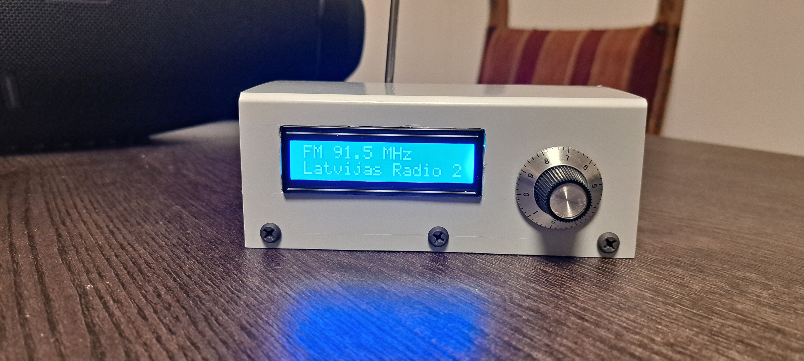
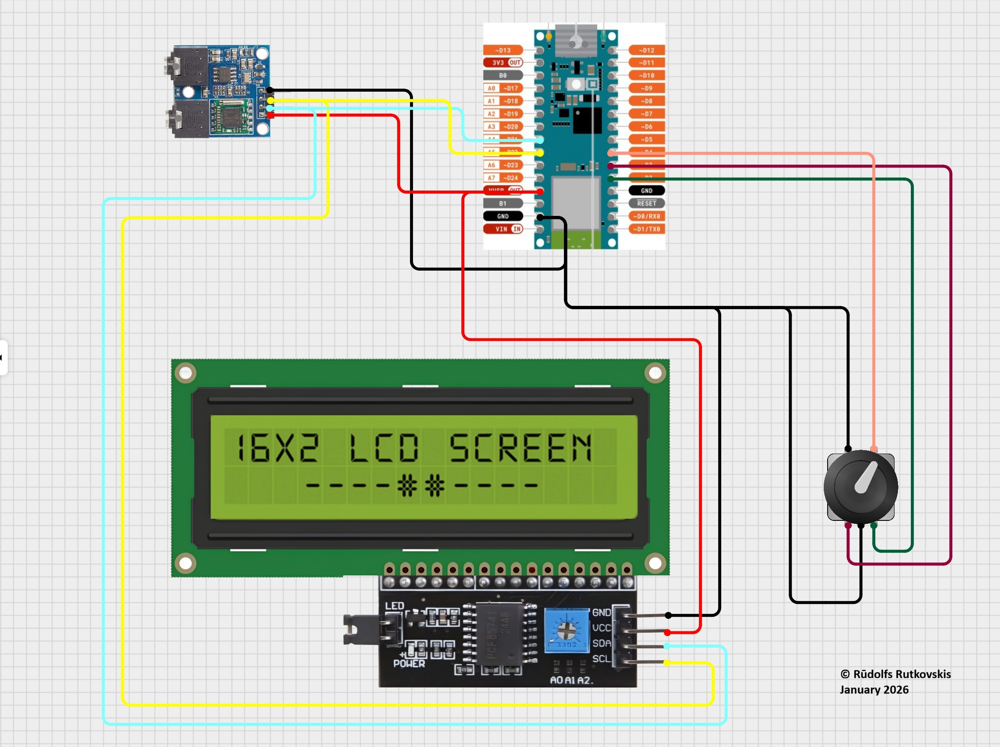
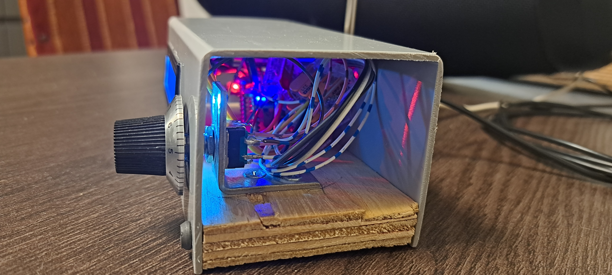
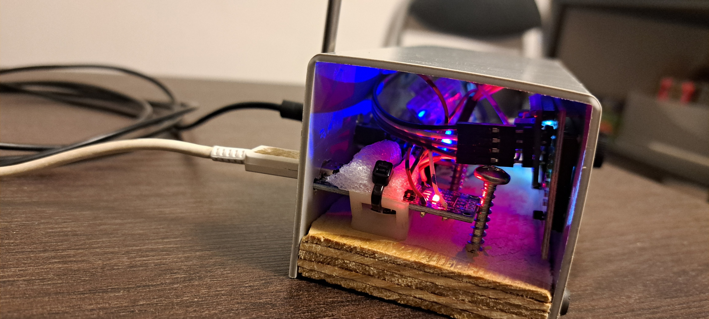

✔ Stable TEA5767 tuning (no random noise storms)

✔ Encoder tuning with acceleration

✔ Silent tuning (mute while moving)

✔ Known-station hopping with encoder button

✔ Saves last fm position (which has been longer than 30sec) in EEPROM

✔ EEPROM save with wear protection timing

✔ LCD station names (fake RDS, best kind 😄)

✔ No blocking delays except where they’re harmless

✔ Clean wrap-around logic

✔ No I²C bus abuse

Parts used:
  TEA5767 FM Stereo Radio Module 76-108MHZ With Free Cable Antenna
  PEC11R-4125F-S0018 Encoder + random plastic cap from old parts
  Arduino NANO V3.0 AVR ATMEGA328P Type C
  LCD1602 with I2C Interface
  Box from scrap pieces

---
## 📐 Schematic

## 🔌 Wiring

## 📷 Demo Video

